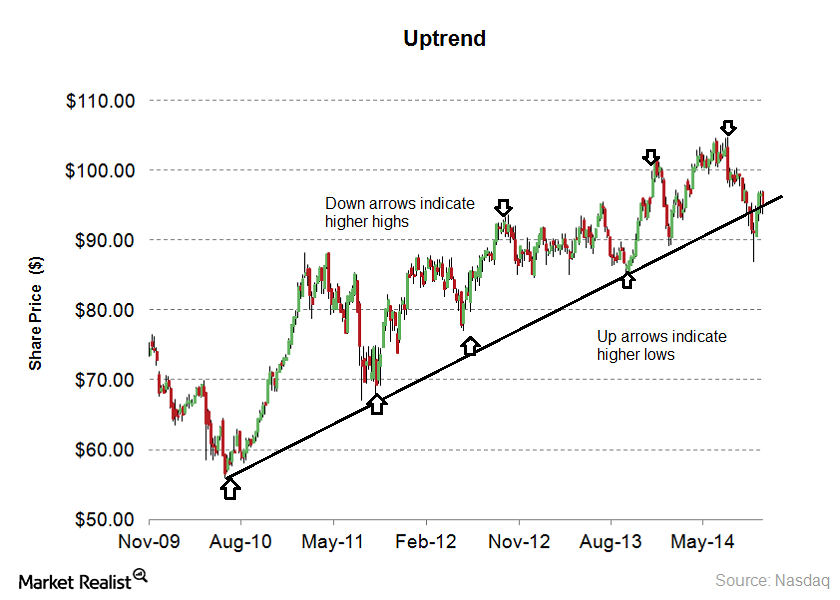
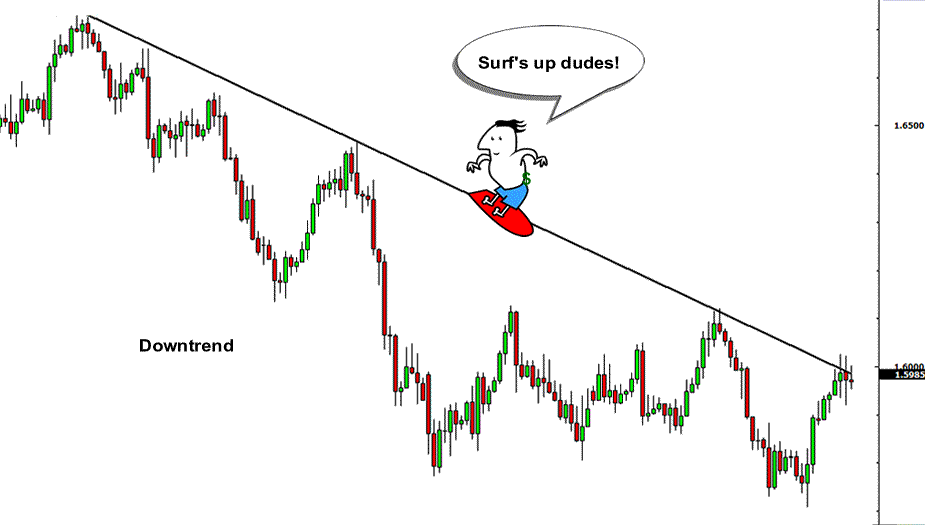
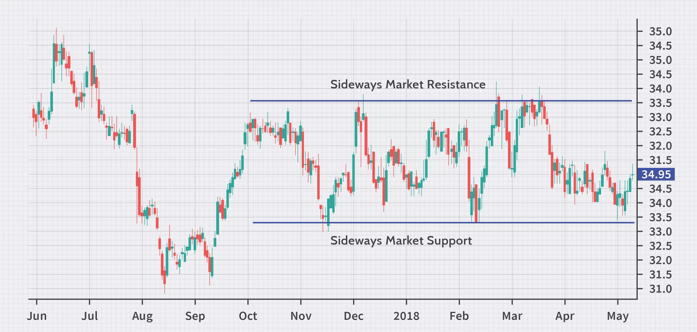
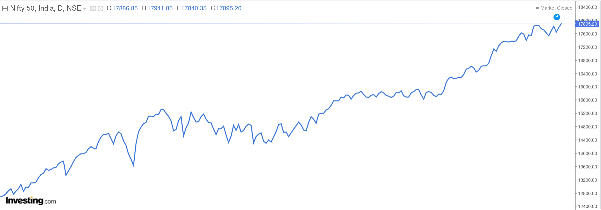
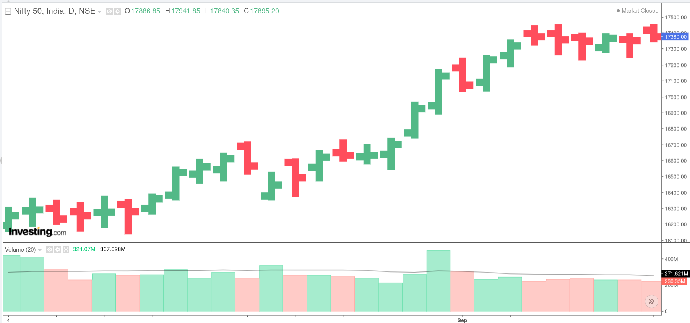
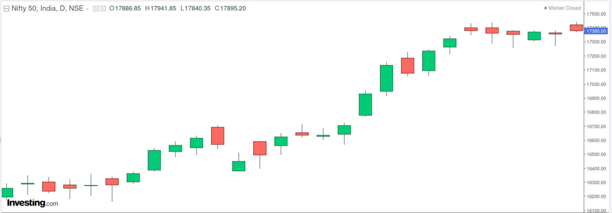
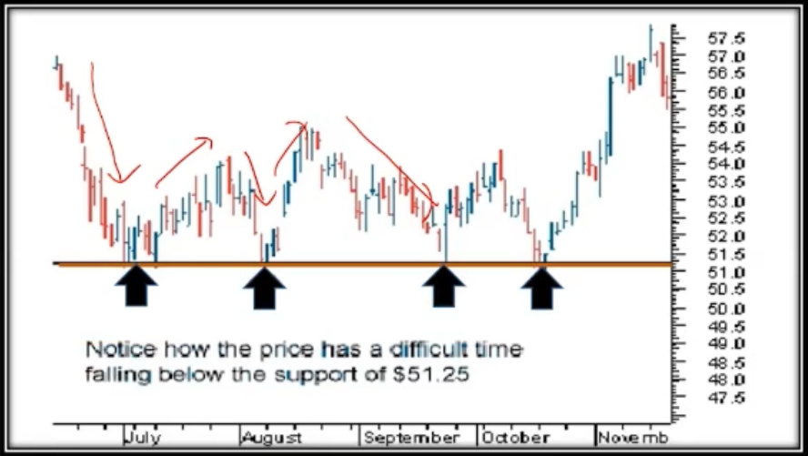
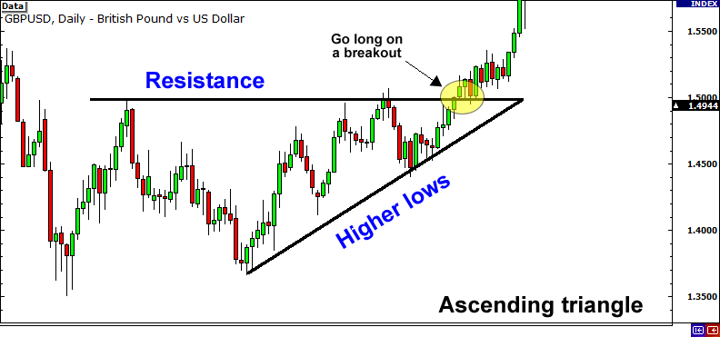
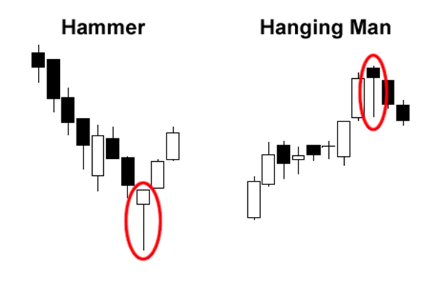

# Technical Analysis

## Analyzing the past

- It is a well established fact that stock prices show cyclical movements, similar to a business.
- It is a process of identifying trends & trend reversals at an earlier stage to formulate buy-sell strategy.
- A good technical Analyst always considers facts. He stays away from emotions like greed & panic while taking his decision

## Know Yourself

- Intraday Trader - Closes the trade within a day.
- Short Term Investor - Closes a trade in 2 days to 3 months.
- Medium Term Investor - Closes a trade in 3 months to 1 year.
- Long Term Investor - Closes a trade after 1 year.

## Trends

- The meaning of trend in finance isn't all that different from the general definition of the term - a trend is really nothing more than the general direction.
- We do see trends even while watching IPL matches!

### Uptrends

- It is a collection of moves and down moves.
- Uptrend is evidenced by creation of higher highs and higher lows.

### Downtrends

- It is a collection of Down moves and Up moves.
- Downtrend is evidenced by creation of Lower highs and Lower lows.
- Thumb rule: NEVER BUY IN AN DOWNTREND!

### Sideways trend

- Downtrend is evidenced by prices moving within a range.
- Thumb rule: NEVER TRADE IN AN SIDEWAYS TREND! WAIT AND WATCH FOR THE DIRECTION OF BREAKOUT!
- Special Tip: Call option can be sold in sideways trend as time value is going down!

## Charts

Charts and patterns are integral part of technical analysis

### Line chart

- It is a most basic of all charts
- Just like line that connects the closing price over a time frame
- There is no trading range

### Bar charts

- Left line represents opening price
- Right line represents closing price
- Red = down
- Blue/Green = up

### Volume Bar chart

- Number of shares that change hands between sellers and buyers
- Price movement is more sinificant when volume is above average

### Candlestick chart

- Vertical line represents the trading range
- Green/White Chadlestick = Bullish
- Red/Black Candlestick = Bearish

## Plotting trend lines

Visually, a trend can be understood. However, if we plot a trend line, then, it can help us for further analysis.

Things to be kept in mind while drawing a trend line are:
- Ensre that the trend line at least touches 2 points(Higher the better)
- Wicks can be joined by the trend line.
- Note: Wicks can be cut by the trend line. However the body **should not** be cut by the trend line.

## Support and Resistance

- Support level is a price level where the price trends to find support as it is going down

- Resistance level is a price where the price trends to find resistance as it is going up

### Importance

- Support and resistance analysis is an important part of trends because it can be used to make trading decisions and identify when a trend is reversing.
- A resistance once broken becomes a support and a support once broken becomes a resistance.

## Breakout

- The penetration of support and resistance level is called breakout

## Volumes

- Volumes provide us with the intensity of a given price move(very **important** element of technical analysis)
- If current day's volume is higher than imidiate five previous volume bars, its a good confirmation on volumes.

## Candlestick bullish patterns

### Bullish Engulfing

- In this case, the second candle's body (a bullish one) completely engulfs the previous day's candle. Both the tail or the wick of the caldle of first bar are covered by the second one.
- Such patterns are powerful if they are formed at the bottom of the correction in a bullish move or near the bottom of a bear move. Such patterns are also seen at the end of a consolidation.

### Morning Star

- A Morning star is a bullish three candle pattern which is formed at the bottom of a down move/trend.
- The first candle = a big bearish candle which clearly defines the down move.
- The second candle = a small candle, which is ideally a Doji candle(indecisive).
- The third candle = a large bullish candle which closes near the top of the day.
- The pattern signifies extreme selling as witnessed in the first candle, followed by a change of power as shown in the second candle and finally the bulls taking over the and regaining lost ground.

### Hammer

- The Hammer formation is created when the open, high, and close are roughly the same price. Also, there is a long lower shadow, twice the length as the real body.
- Hammer is MOST EFFECTIVE if it occurs at "Bottom of the downward trend"
- It is considered as a Bullish Reversal Pattern.
- Confirmation of the reversal is to be taken before taking any position.
- The color of the real body is not important.

### Inverted Hammer:

- The long shadow is about two or three times of the real body.
- Little or no lower shadow.
- The color of the real body is not important.

> Note: Hammer/Inverted Hammer formed at the end of down trend with a bullish candle are a bit powerful as compared to bearish candles

## Candlestick bearish patterns

### Bearish Engulfing

- In this case, the second candle's body (a bearish one) completely engulfs the previous day's candle. Both the tail or the wick of the caldle of first bar are covered by the second one.
- It is more powerful if they are formed at the top of a up trend/move.

### Evening Star

- It is formed when a green candle is followed by a doji candle which is then folliwed by a big bearish candle
- This will be most powerful when it is formed at the end of uptrend

### Similar but Different

## Indicators

- A mathematical tool that can be applied on security's price giving a result that can be used to anticipate trends, volatility and price.
- One of the most commonly used indicator is a Moving Average indicator.

### Moving Average

- A simple moving average is calculated by taking average of most recent closing prices of n time period.
- Exponential Moving average applies weighting factors which decrease exponentially.

- 5 days moving average is like analyzing 1 week's data
- 13 days moving average is like analyzing 1 fortnight's data
- 26 days moving average is like analyzing 1 month's data
- In majority cases, the 5days Moving Average line is close to the CMP

### Stratergy - Buy

- When 5 DEMA cuts the 13 DEMA from below, its an anticipatory buy.
- When 5 DEMA cuts the 26 DEMA from below, its an confirmatory buy.
- The buy call is strengthened if the volumes are also in the same direction.
- If 5 DEMA cuts 13 DEMA and 26 DEMA on the same day with increased volumes, it's a confirmatory buy.

> Note: Instead of the word below if we use the word above it will be sell stratergy

Moving average is an effective indecator, however it is treated as lagging indecator i.e. it generates delayed buy/sell calls

<!-- ## MACD(Moving Averages Convergence Divergence) -->

<!-- trend, candlestick patterns, volume, support, resistance -->
<!-- 1) Idea 2)Avenue Supermarket 3) IRCTC 4) Britania 5) PVR 6) Motherson Sumi 7) Tata Motors 8) Cummins India 9) Bajaj Finserve — Is the uptrend intact? 10) HDFC Bank 11)Date: 20.8.2018 — Yes Bank -->
