# Technical Analysis

## Analyzing the past

- It is a well established fact that stock prices show cyclical movements, similar to a business.
- It is a process of identifying trends & trend reversals at an earlier stage to formulate buy-sell strategy.
- A good technical Analyst always considers facts. He stays away from emotions like greed & panic while taking his decision

## Know Yourself

- Intraday Trader - Closes the trade within a day.
- Short Term Investor - Closes a trade in 2 days to 3 months.
- Medium Term Investor - Closes a trade in 3 months to 1 year.
- Long Term Investor - Closes a trade after 1 year.

## Trends

- The meaning of trend in finance isn't all that different from the general definition of the term - a trend is really nothing more than the general direction.
- We do see trends even while watching IPL matches!

### Uptrends

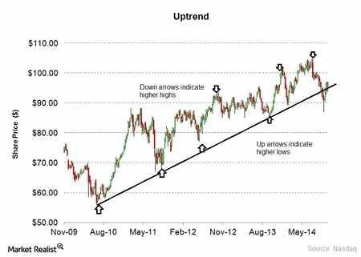

- It is a collection of moves and down moves.
- Uptrend is evidenced by creation of higher highs and higher lows.

### Downtrends

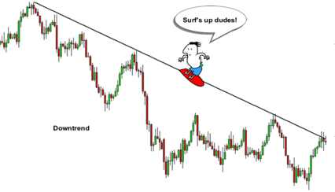

- It is a collection of Down moves and Up moves.
- Downtrend is evidenced by creation of Lower highs and Lower lows.
- Thumb rule: NEVER BUY IN AN DOWNTREND!

### Sideways trend

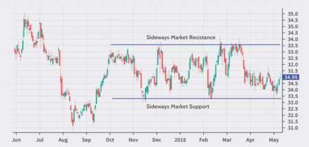

- Downtrend is evidenced by prices moving within a range.
- Thumb rule: NEVER TRADE IN AN SIDEWAYS TREND! WAIT AND WATCH FOR THE DIRECTION OF BREAKOUT!
- Special Tip: Call option can be sold in sideways trend as time value is going down!

## Charts

Charts and patterns are integral part of technical analysis

### Line chart

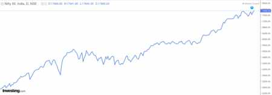

- It is a most basic of all charts
- Just like line that connects the closing price over a time frame
- There is no trading range

### Bar charts

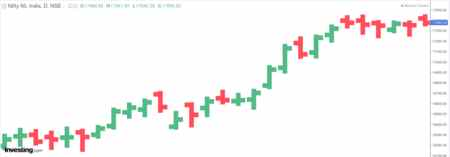

- Left line represents opening price
- Right line represents closing price
- Red = down
- Blue/Green = up

### Volume Bar chart

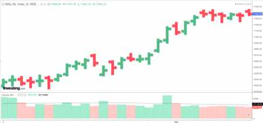

- Number of shares that change hands between sellers and buyers
- Price movement is more sinificant when volume is above average

### Candlestick chart

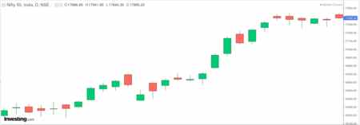

- Vertical line represents the trading range
- Green/White Chadlestick = Bullish
- Red/Black Candlestick = Bearish

## Plotting trend lines

Visually, a trend can be understood. However, if we plot a trend line, then, it can help us for further analysis.

Things to be kept in mind while drawing a trend line are:
- Ensre that the trend line at least touches 2 points(Higher the better)
- Wicks can be joined by the trend line.
- Note: Wicks can be cut by the trend line. However the body **should not** be cut by the trend line.


## Support and Resistance

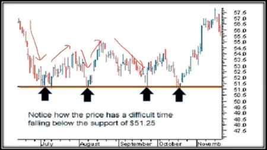

- Support level is a price level where the price trends to find support as it is going down

- Resistance level is a price where the price trends to find resistance as it is going up

### Importance

- Support and resistance analysis is an important part of trends because it can be used to make trading decisions and identify when a trend is reversing.
- A resistance once broken becomes a support and a support once broken becomes a resistance.


## Breakout

- The penetration of support and resistance level is called breakout

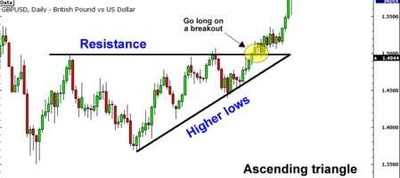

## Volumes

- Volumes provide us with the intensity of a given price move(very **important** element of technical analysis)
- If current day's volume is higher than imidiate five previous volume bars, its a good confirmation on volumes.


## Candlestick bullish patterns

### Bullish Engulfing

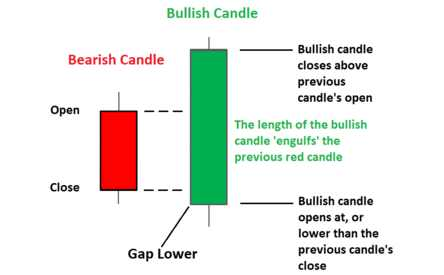

- In this case, the second candle's body (a bullish one) completely engulfs the previous day's candle. Both the tail or the wick of the caldle of first bar are covered by the second one.
- Such patterns are powerful if they are formed at the bottom of the correction in a bullish move or near the bottom of a bear move. Such patterns are also seen at the end of a consolidation.

### Morning Star

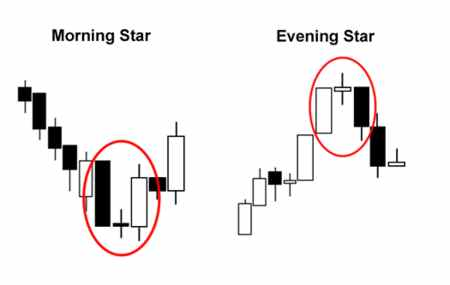

- A Morning star is a bullish three candle pattern which is formed at the bottom of a down move/trend.
- The first candle = a big bearish candle which clearly defines the down move.
- The second candle = a small candle, which is ideally a Doji candle(indecisive).
- The third candle = a large bullish candle which closes near the top of the day.
- The pattern signifies extreme selling as witnessed in the first candle, followed by a change of power as shown in the second candle and finally the bulls taking over the and regaining lost ground.

### Hammer

- The Hammer formation is created when the open, high, and close are roughly the same price. Also, there is a long lower shadow, twice the length as the real body.
- Hammer is MOST EFFECTIVE if it occurs at "Bottom of the downward trend"
- It is considered as a Bullish Reversal Pattern.
- Confirmation of the reversal is to be taken before taking any position.
- The color of the real body is not important.

### Inverted Hammer:

- The long shadow is about two or three times of the real body.
- Little or no lower shadow.
- The color of the real body is not important.

> Note: Hammer/Inverted Hammer formed at the end of down trend with a bullish candle are a bit powerful as compared to bearish candles


## Candlestick bearish patterns

### Bearish Engulfing

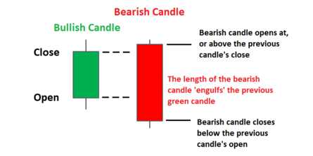

- In this case, the second candle's body (a bearish one) completely engulfs the previous day's candle. Both the tail or the wick of the caldle of first bar are covered by the second one.
- It is more powerful if they are formed at the top of a up trend/move.

### Evening Star

- It is formed when a green candle is followed by a doji candle which is then folliwed by a big bearish candle
- This will be most powerful when it is formed at the end of uptrend

### Similar but Different

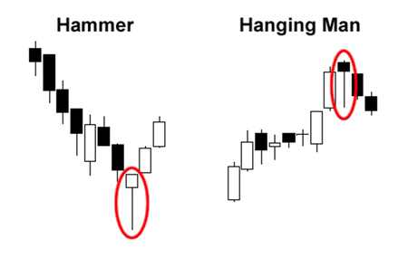
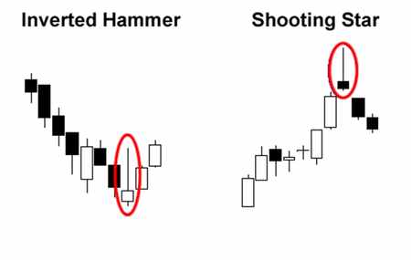


## Indicators

- A mathematical tool that can be applied on security's price giving a result that can be used to anticipate trends, volatility and price.
- One of the most commonly used indicator is a Moving Average indicator.

### Moving Average

- A simple moving average is calculated by taking average of most recent closing prices of n time period.
- Exponential Moving average applies weighting factors which decrease exponentially.

- 5 days moving average is like analyzing 1 week's data
- 13 days moving average is like analyzing 1 fortnight's data
- 26 days moving average is like analyzing 1 month's data
- In majority cases, the 5days Moving Average line is close to the CMP

### Stratergy - Buy

- When 5 DEMA cuts the 13 DEMA from below, its an anticipatory buy.
- When 5 DEMA cuts the 26 DEMA from below, its an confirmatory buy.
- The buy call is strengthened if the volumes are also in the same direction.
- If 5 DEMA cuts 13 DEMA and 26 DEMA on the same day with increased volumes, it's a confirmatory buy.

> Note: Instead of the word below if we use the word above it will be sell stratergy

Moving average is an effective indecator, however it is treated as lagging indecator i.e. it generates delayed buy/sell calls


## MACD(Moving Averages Convergence Divergence)

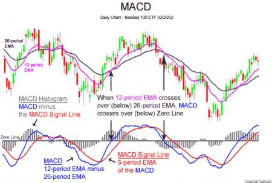

- MACD is calculated by subtracting 26 days moving average from moving average of 12 days
- I.e. MACD = 12 DEMA - 26 DEMA
- We get various amounts by subtracting the EMAs. MACD line is formed by joining all these dots.
- MACD > 0 --> strength
- MACD < 0 --> weakness
- When the MACD is above 0, it means that 12 days moving average is higher than the 26 days moving average
- This is bullish since current trend is more bullish as compared to a medium term trend.
- Ideally we see weakness first and then price falls
- Similarly, we see strength first and then price rises

- Signal line is 9 DEMA of MACD

- MACD Line — Blue line (Fast line)
- Signal Line — Orange line (Slow line)
- Histogram — Bars (Indicates the difference between MACD line and Signal Line)

### Statergy

- If MACD line cuts the signal line from above = **SELL**
- If MACD line cuts the signal line from below = **Buy**


## RSI(Relative Strength Index)

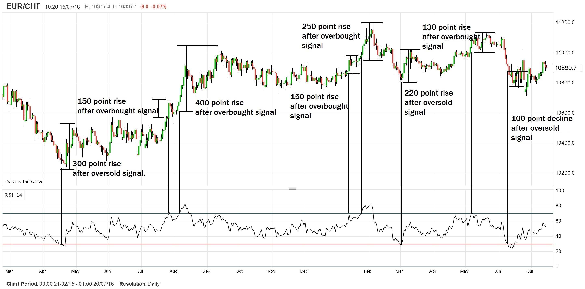

- The relative strength index (RSI) is a momentum indicator that measures the magnitude of recent price changes.
- RS1 is an oscillator ie it moves to and fro within a range. The range is from 0 to 100.
- The indicator was originally developed by J. Welles Wilder Jr. and introduced in his seminal 1978 book, New Concepts in Technical Trading Systems.
- It evaluates overbought or oversold conditions in the price of a stock or other assets.

    ```
    RSI = 100 - 100/(1+RS)

    RS = Average Gain over specified Period / Average Loss over the same period
    ```
- Generally RSI is calculated for 14 days
- RSI will rise as the number and size of positive closes increase, and it will fall as the number and size of losses increases

### Statergy

#### Traditional

- RSI < 30 indicates an oversold position (Buy Signal)
- RSI > 70 indicates an overbought position (Sell Signal)

However, if the security/ overall market is very bullish, it may remain in the overbought position for a long period of time. In such a situation, 80 can be taken as an overbought signal.

Similarly, if the security/ overall market is very bearish, it may remain in the oversold position for a long period of time. In such a situation, 20 can be taken as an oversold signal.

#### The new way

- RSI > 60 = Uptrend continues = **BUY**
- RSI taking support at 60 = Bullish
- RSI < 40 = Downtrend = Stop Loss or **SELL**
- RSI facing resistance at 40 = Bearish
- RSI between 40 & 60 is sideways trend

> Ideally take 8 to 10 months data

#### Statergy for MACD + RSI

- Target price should be around 3-5% returns in timespan of maximum 10 days (swing)
- StopLoss will be equal to median of the breakout trend (`opening+closing / 2`)
- When there is:
    - MACD bullish crossower
    - RSI is above 60


## Bollinger Bands

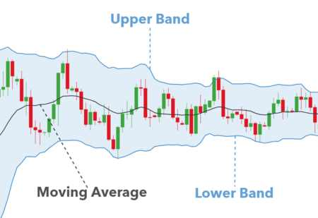

- 20 DEMA line acts as basic support if current price is above 20 DEMA
- Upper Bollinger band which stands at 2 standard deviations will act like resistance in 95% cases
- Lower BB which stands at 2 std will act as support in 95% cases
- BB Squeeze: If the squeeze is for longer duration and if the current candle breakes the upper bb then it is a **BUY** call
    > Higher squeeze the better (min 1 month)
- StopLoss will be determind in the same way and trailing stoploss will be privious day's candle's low


## Fibonacci Retracement

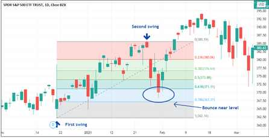

- This theory is based upon the Fibonacci number sequence. Fibonacci numbers are such that they tend to repeat themselves in nature. These numbers were used to determine breeding cycles of rabbits and are now being used in architecture, art and trading. From petals of flowers to prices of stocks everything is said to be in this pattern.
- The number series starts with 0,1 and then the next numbers are derived by adding the previous two number and goes like 1,2,3,5,8,13,21,34,55,89,144,233, ....
- Heard about the GOLDEN RATIO? Yes, that's another creation of the Fibonacci number sequence it is the succeeding number divided by the preceding number eg: - 233/144= 1.6180.
- As far as technical analysis is concerned we have to look out for the % patterns that these numbers follow which is given below.
    - 21/89= 0.2360 (23.60%)
    - 34/89= 0.3820 (38.20%)
    - 55/89= 0.6120 (61.20%)
- In stock market Golden Ratio can be used for the level from which stock can retrace

### How to draw fibonachi

- In an uptrend join the lowest point on the screen to the highest point on the screen(same for downtred)
- Take around 9 months data for better results
> Research some more


## Bullish Chart Pattern

### Up Flag

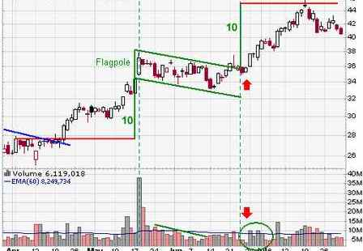

- It is seen by
    - Up move
    - Sideways trend(cloth of the flag)
    - Close above resistance
    - If it is accompined by increase in volume, it is better
- Calculstion o price target:
- Calculate the distance from start of the pole(upmove) till the resistance(upper part of flag)
- Assume this distance as `x`, then price target will be `x + support(lower cloth of flag)`
- Time target = Number of candles from candle to breakout candle divided by 3

### Inverted Head and Shoulder

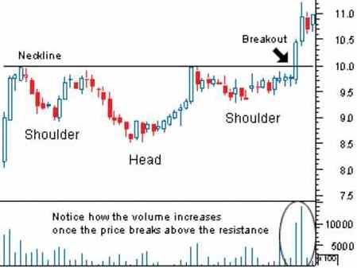

- Close is above neckline
- Increased volumes on Breakout candle
- X = Vertical distance frorn Low of Head to Neckline
- Price Target = Intersection point of the neckline and Breakout candle + X
- Time Target = Number of candles from /1st Neck Point to Breakout candle divided by 3.

### Double bottom (W)

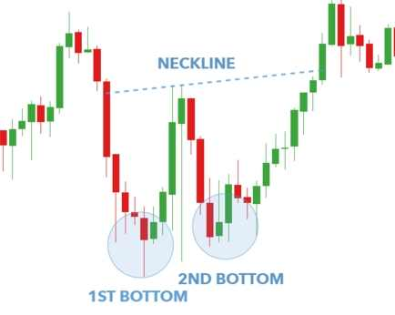

- Equal bottoms from the same downtrend
- White candle with increased volumes after 2nd bottom
- X = Vertical distance from double bottom level to highest point between 2 bottoms
- Target = Bottom Level + (X/2)
- Time = No. of candles from 1st bottom to white candle, divided by 3

### Rounding Bottom

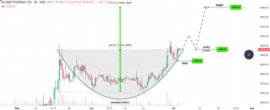

- Criteria:
- Historically highly priced
- Sharp fall
- Consolidation for minimum 2 years
- Breakout above the resistance from consolidation
- This is a MULTI BAGGER Pattern
- The study is to be done only on a monthly chart.

- Price Target = Historic high, expected to be achived within 1 year
- 2nd Price Target = 5 times of the breakout level, expected to be achived in 2 years from the breakout

### Listing Breakout

- Market euphoria at the time of listing
- Price begins to consolidate after which it makes a new high
- Price is overvalued & thus drifts downwards for next 2 years. Price will justify the business valuations and will trade at this level for the next 8 to 10 months.
- As the business improves, the price will start moving upwards
- Price will reach an all time high level.
- Breakout above the old resistance.


## Bearish Chart Pattern

### Head and Shoulders

- This formation is characterized by 2 small peaks on either side of a larger peak
- Close is below neckline
- Increased volumes on Breakout candle
- X = Vertical distance from High of Head to Neckline
- Price Target = Intersection point of the neckline and Breakout candle — X
- Time Target = Number of candles from 1st Neck Point to Breakout candle divided by 3.

### Double Top

- Similar to H&S with no head
- Equal bottoms from the same uptrend
- Black candle with increased volumes after 2nd top
- X = Vertical distance from double top level to the lowest point between 2 tops
- Target = Double Top Level - (X/2)
- Time = No. of candles from 1st top to black candle, divided by 3


<!-- trend, candlestick patterns, volume, support, resistance -->
<!-- 1) Idea 2)Avenue Supermarket 3) IRCTC 4) Britania 5) PVR 6) Motherson Sumi 7) Tata Motors 8) Cummins India 9) Bajaj Finserve — Is the uptrend intact? 10) HDFC Bank 11)Date: 20.8.2018 — Yes Bank -->
